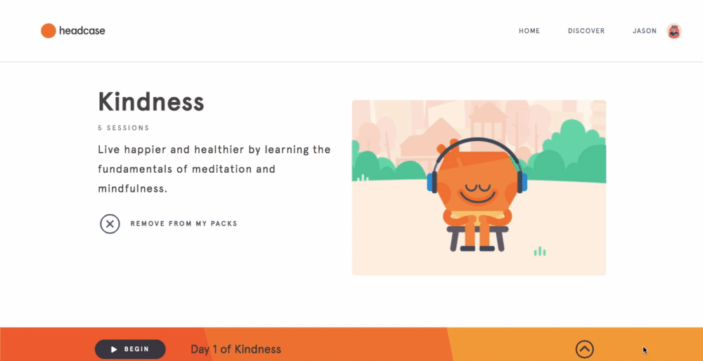

# Description

headcase is a single page web app clone of of the meditation website <a href="https://www.headspace.com/" target="_blank">headspace</a> that allows users to stream guided meditations. Check out the live site <a href="https://headcase-aa.herokuapp.com/#/" target="_blank">here</a>!


# Technologies 

Frontend: 

* React
* Redux
* SCSS
* HTMLAudioElement API

Backend:

* Ruby on Rails
* PostgreSQL

Hosting: 
* AWS S3
* Heroku

# Features

* User Authentication, including error handling and "Demo User" login 
* Custom audio player built with the HTMLAudioElement API and DOM Event Listeners
* CRUD (Create, Read, Update, Delete) functionalities for a user's "User Packs"
* "Meditation Completions" to track the meditations the user has listened to in each "User Pack"
* Media management and hosting with Rails Active Storage and AWS S3



# Project Highlights 

One major challenge of this project was creating an audio player from scratch. I chose to utilize the HTMLAudioElement API, which gave me access to the properties and methods of ```<audio>``` elements while also giving me the flexibility of custom styling. These event listeners are applied in the ```componentDidMount``` function.

```js
  componentDidMount() {
    this.handleTimeUpdate();
    this.audio.addEventListener('loadedmetadata', this.handleMetadata);
    this.audio.addEventListener('ended', this.handleCompletion);
    this.audio.addEventListener('timeupdate', this.handleTimeUpdate);
  }
```

The ```handleTimeUpdate``` function accesses the ```currentTime``` and ```duration``` properties on the ```Audio``` instance. It formats the current time and duration to be displayed beneath the player as well as calling the ```positionTime``` function which updates the position of the handle on the progress bar.

```js
  handleTimeUpdate() {
    if (this.audio) {
      let curMins = Math.floor(this.audio.currentTime / 60);
      let curSecs = Math.floor(this.audio.currentTime - curMins * 60);
      let durMins = Math.floor(this.audio.duration / 60);
      let durSecs = Math.floor(this.audio.duration - durMins * 60);
      if (curSecs < 10) {
        curSecs = "0" + curSecs;
      }
      if (durSecs < 10) {
        durSecs = "0" + durSecs;
      }
      if (curMins < 10) {
        curMins = "0" + curMins;
      }
      this.setState({ durMins })
      if (durMins < 10) {
        durMins = "0" + durMins;
      }
      this.setState({
        currentTime: curMins + ":" + curSecs,
        durTime: durMins + ":" + durSecs,
        currentTimeUnMod: this.audio.currentTime
      })
      let ratio = this.audio.currentTime / this.audio.duration;
      if (this.outer) {
        let position = (this.outer.offsetWidth * ratio) + this.outer.offsetLeft;
        this.positionTime(position);
      }
    }
  }

  positionTime(position) {
    let outerBarWidth = this.outer.offsetWidth - this.range.offsetWidth;
    let rangeLeft = position - this.outer.offsetLeft;

    if (rangeLeft >= 0 && rangeLeft <= outerBarWidth) {
      this.range.style.marginLeft = rangeLeft + "px";
    }
    if (rangeLeft < 0) {
      this.range.style.marginLeft = "0px";
    }
    if (rangeLeft > outerBarWidth) {
      this.range.style.marginLeft = outerBarWidth + "px";
    }
  }
  ```

The audio player features an animated button that toggles between play and pause, a progress bar that shows the current position of the audio track based on the current time vs the track duration, and the ability for the user to click the progress bar to seek. These features are created by utilizing local react state inside of the ```PlayPage``` component as well as handling a user's interactions with the progress bar.

```js
  togglePlay() {
    this.setState({ play: !this.state.play }, () => {
      this.state.play ? this.audio.play() : this.audio.pause();
    });
  }

  handleMouseMove(e) {
    this.positionTime(e.pageX)
    this.audio.currentTime = (e.pageX - this.outer.offsetLeft) / this.outer.offsetWidth * this.audio.duration;
  }

  handleMouseDown(e) {
    window.addEventListener('mousemove', this.handleMouseMove);
    window.addEventListener('mouseup', this.handleMouseUp);
  }

  handleMouseUp(e) {
    window.removeEventListener('mousemove', this.handleMouseMove);
    window.removeEventListener('mouseup', this.handleMouseUp);
  }
  
```

Additionaly, an ```onEnded``` event listener is applied to the audio track, which allows for a "Meditation Completion" to be created when the user finishes listening to a meditation. 

```js
  handleCompletion() {
    this.setState({ play: false })
    let meditationCompletion = {
      userPackId: this.props.currentUp.id,
      meditationId: this.props.currentMed.id
    }
    this.props.action(meditationCompletion);
  }
```

# To Do 

* Edit audio player to function more closely to the headspace audio player
* Implement meditation completion timeline on the user's profile page